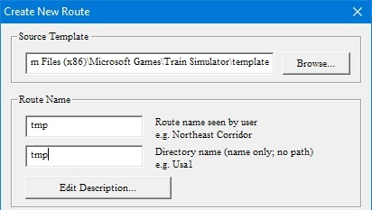

.. _distant_mountains:

******************************
Modellare le montagne distanti
******************************

La procedura di creazione delle montagne distanti si effettua sempre con Demex
(se non avete la versione registrata va usato in modalità ``Demostration``)

.. image:: images/demex_demonstration.jpg

Accertiamoci che fra le route sia presente lo scenario di default USA2 (Marias Pass):
durante il processo di costruzione vengono prelevati alcuni files da questa route.

Apriamo il ``Route Geometry Extractor`` e creiamo una route chiamata *Temporanea*: non è necessario creare il 
quad-tree, bastano solo i parametri generali.

Apriamo Demex (se non avete la versione registrata va usato in modalità ``Demostration``)

Quindi nel menù ``File`` selezioniamo la voce ``Select Route`` e dall'elenco la nostra route.

.. image:: images/dm3.jpg

Sempre dal menu ``File`` selezioniamo ``Refresh Route Tiles``

Poi dal menu ``Distant Mountains Terrain`` selezioniamo ``Prepare Route``

Confermiamo con ``OK`` e minimizziamo Demex.

Apriamo nuovamente il ``Route Geometry Extractor`` e quindi apriamo la nostra route

Dal menu ``File`` scegliamo ``Load Quad Tree`` quindi ingrandiamo al massimo centrando la zona della nostra route.

Dobbiamo quindi cliccare il pulsante delle distant mountains, quello con la freccia verso il basso.

La mappa si svuota dei quadrettini e potremo creare una nuova selezione per le nostre montagne distanti
come abbiamo fatto per il terreno normale; questa volta conviene abbondare nella selezione affinchè il paesaggio
si estenda anche a parecchi km dalla linea.

Con il tasto sinistro facciamo un rettangolo grande che comprenda la zona da creare. 
All'interno della selezione, cliccando con il tasto destro del mouse appare un menu
dal quale dobbiamo selezionare ``Add all Selection Tiles``. Possiamo ripetere l'operazione
più volte fino a selezionare tutta la zona che ci interessa.

Al termine della selezione, sempre cliccando con il tasto destro del mouse, 
dal menu selezioniamo ``Toggle Populated State`` (all'interno dei quadrati appare una X).

.. image:: images/dm5.jpg

``File`` ``Save Quad Tree``
``Edit`` ``Generate Flagged Tiles``
``File`` ``Save Quad Tree``

Possiamo chiudere il ``Route Geometry Extractor``

Ingrandiamo Demex

``File`` ``Refresh Route Files``
``Distant Mountains Terrain`` ``Select Temporary Route`` ``OK``

Utilizzando il sesto ed il settimo bottone della toolbar possiamo passare dal quad-tree del terreno normale a quello
delle distant mountains, selezioniamo ovviamente queste ultime.

Adesso dobbiamo caricare le DEM (eventualmente anche con il merge) come già fatto per il terreno normale. 
Aiutatevi con lo zoom per vedere la mappa nel suo complesso. 

``Distant Mountains Terrain`` ``Create distant mountain Terrain -step 3`` ``OK``

Minimizzare DEMEX

Apriamo il ``Route Editor``

Selezionare la Route Temporanea creando quindi il Terrain Buffer. Così facendo si creano i Tiles nell’omonima cartella della Route temporanea

Chiudiamo il ``Route Editor``

Ingrandiamo nuovamente Demex

``Distant Mountains Terrain`` ``Copy DM tiles back to route -step 5`` ``OK``

Chiudere definitivamente Demex

Controllare nelle cartelle LO-TILES e TD della vostra route ci siano I fles corretti.
Aprire la route in MSTS (si presume abbiate creato una mini activity e quindi un Path funzionante e vdere se le DM ci sono

