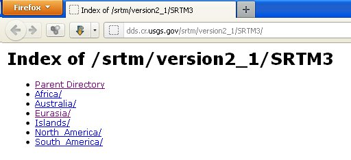
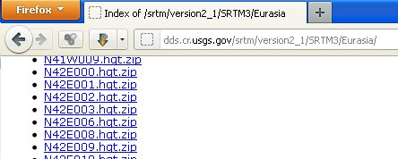
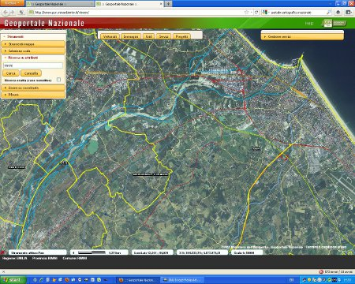
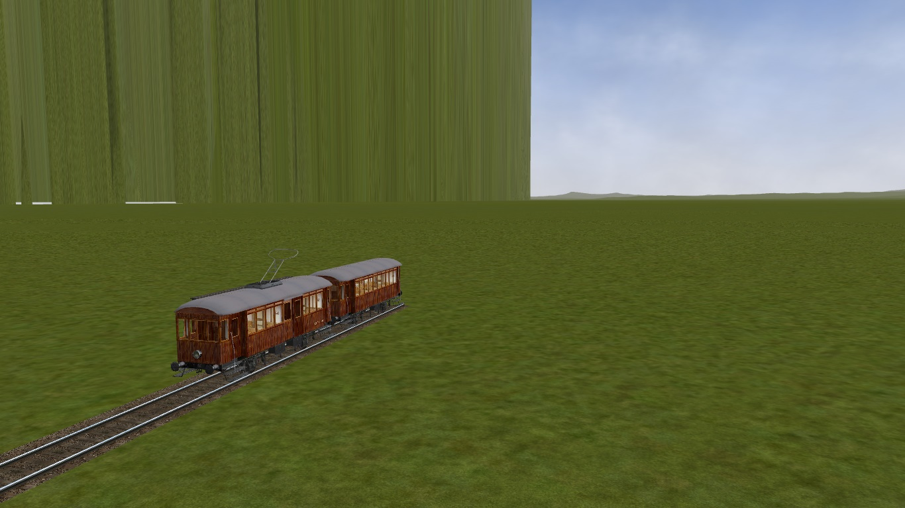

.. _dm_download:

*********************
Dove prelevare le DEM
*********************

Abbiamo il programma di conversione, ma dove possiamo trovare i dati da convertire?

NASA
====

La fonte principale è senza dubbio il sito della NASA da dove si possono prelevare le “mattonelle” 1°x1° dei dati con risoluzione 3 secondi di arco (alle nostre latitudini circa 90 metri).
L'indirizzo da visitare è: http://dds.cr.usgs.gov/srtm/version2_1/SRTM3/

La navigazione non è delle più agevoli: i dati sono raggruppati per continenti e all'interno delle varie cartelle ci sono un gran numero di file il cui nome ci indica a quale area si riferiscono.

Nello stesso sito ci sono anche dei dati più dettagliati con una risoluzione di 1 secondo d'arco (circa 30m), ma solo per il territorio degli USA.

viewfinderpanoramas
===================

Per alcune zone del globo, generalmente catene montuose, ci sono anche dei file interpolati con dati cartografici che raggiungono la stessa risoluzione di 1 secondo d'arco, si possono trovare all'indirizzo:
http://www.viewfinderpanoramas.org/dem3.html

Portale cartografico nazionale
==============================

Per quanto riguarda il territorio italiano abbiamo un'altra possibilità: sono i dati che si possono prelevare dal sito del 
`Portale Cartografico Nazionale gestito dal Ministero dell'Ambiente <http://www.pcn.minambiente.it/viewer>`_.

Attraverso un web service si possono prelevare svariati tipi di mappe tra cui dei dati DEM con risoluzione orizzontale di soli 20m ottenuti interpolando i dati NASA con le curve di livello delle carte dell'Istituto Geografico Militare (le cosidette “tavolette”).
Per chi non lo sapesse possiamo definire un “web service” come un sito web destinato ad essere utilizzato da un computer; però, componendo con pazienza l'indirizzo da visitare anche un “umano” può ottenerne i dati.

Ho descritto il metodo manuale per  ottenere questi dati componendo manualmente la stringa contenente la url con tutti i parametri da passare al web service in: http://www.trainsimhobby.net/forum/viewtopic.php?f=27&t=7228 
ma era un procedimento piuttosto laborioso.

Ho successivamente preparato una utility con la quale è sufficiente specificare le coordinate dei punti inferiore sinistro e superiore destro della mappa richiesta nelle tradizionali latitudine/longitudine o anche prelevando i punti da placemark di Google Earth.

.. image:: images/pcnurl.jpg

`Il programma è disponibile per il download a questo indirizzo <http://www.trainsimhobby.net/infusions/pro_download_panel/download.php?did=1340>`_.

Recentemente ho scaricato altri dati dal portale e mi sono accorto che al posto del mare c'era una muraglia:

Ho scoperto che il problema era dato da alcuni valori di altezza pari a 32000 metri che probabilmente segnano la fine dei dati 
validi. Per indagare e risolvere il problema ho messo a punto un piccolo 
`tool disponibile su GitHub <https://github.com/strawberryfield/TIFFmanager/releases>`_.