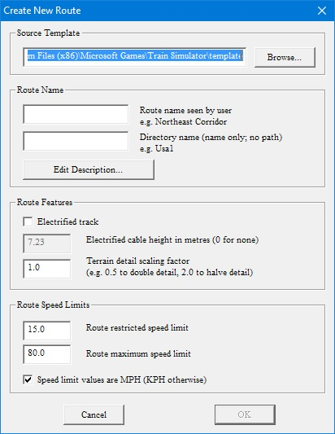
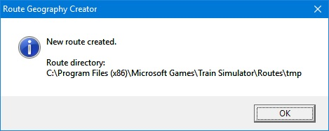
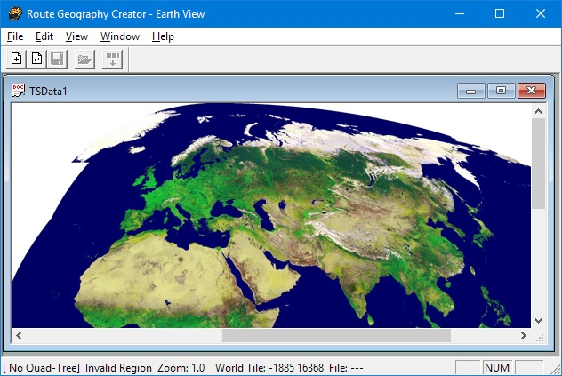
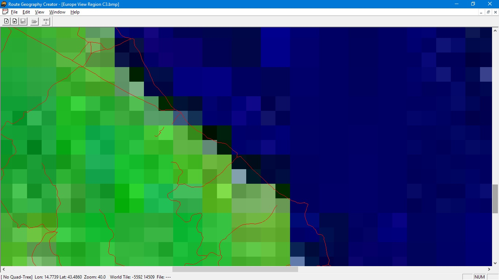
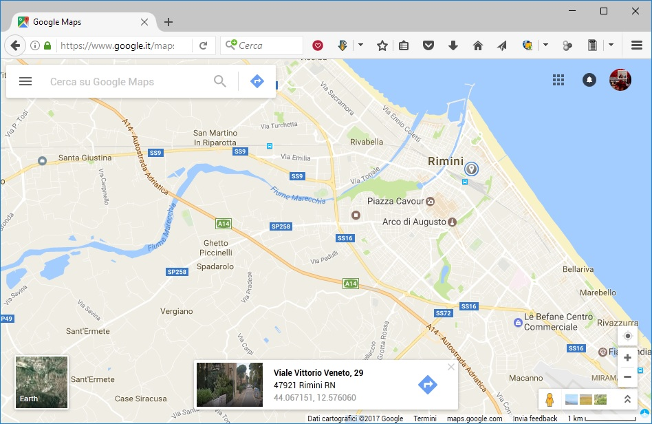
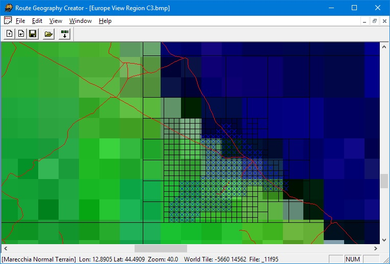

.. _start:

***************
Creare la route
***************

Prima di costruire una nuova linea ferroviaria nel simulatore è necessario creare lo scenario (route) 
ovvero lo spazio a disposizione per poter stendere i binari. Questo è possibile utilizzando il programma Route Geometry Extractor.

.. _parametri:

Parametri generali
==================

Apriamo ``Microsoft Train Simulator Editor & Tools``
e selezioniamo l'ultima riga ovvero ``Route Geometry Extractor``.

.. image:: images/select_rge.jpg

Apriamo il menù ``File`` e clicchiamo su ``New Route``: si aprirà la finestra ``Create New Route``

Inserire il ``Route Name`` (nome della linea). 
In questo campo è necessario inserire il nome e la descrizione della nuova linea (es. *Ferrovie del Marecchia*).
Se volete potete cliccare il tasto ``Edit`` e inserire la descrizione della linea e premete OK.
Questo nome apparirà nella lista delle linee al lancio di Train Simulator.
Nel campo ``Directory`` inserire un nome breve (es. *marecchia*). Questo nome sarà dato alla cartella che conterrà tutti gli strumenti del nuovo scenario (i file di configurazione, i terreni, le forme, le texture ecc.).

Caratteristiche della linea
---------------------------

Nella stessa finestra è possibile anche specificare alcuni altri parametri della linea che andremo a costruire:

 - ``Electrified Track`` va spuntata se la linea è elettrificata; e necessario anche specificare l’altezza in metri della linea aerea (es. 5.7 m). 
 - Nel campo ``Terrain detail scale`` si può variare il numero dei dettagli del terreno. Di solito è meglio lasciare il valore di default.
 - ``Route speed limits``: è possibile specificare nuovi limiti di velocità massima e minima e decidere se usare i Km/h o le Mph (miglia orarie).

Creazione della route vuota
--------------------------- 

Confermiamo le impostazioni date sopra premendo ``OK``.

Il ``Route Geometry Extractor`` creerà una cartella della nuova linea sul disco fisso dentro alla cartella ``Routes``;
al termine dell'operazione apparirà un messaggio che informa che la nuova linea è stata creata
e mostra la locazione della cartella. 

Confermiamo con ``OK``.

Se il tasto ``OK`` non fosse attivo assicuratevi di aver inserito il nome della linea e della cartella. È possibile che per creare la cartella sia necessario qualche decina di secondi. È possibile modificare i dati inseriti fino ad ora,
eccetto il nome della cartella, in qualsiasi momento. 

.. _quad_tree:

Definire l'area
===============

Apriamo nuovamente il menù ``File`` e clicchiamo su ``Select Route``

Ci apparirà un menu a tendina che permette di selezionare una linea, 
nel nostro caso selezioneremo quella appena creata 
e confermiamo con ``OK``

Sempre nel menù ``File`` clicchiamo su ``New Quad Tree``

Il nome della cartella della nuova linea e la scritta ``Normal Terrain`` appaiono sulla barra di stato in basso a sinistra. Non appare nient’altro finchè non selezioniamo il territorio.
Cliccare con il tasto destro del mouse nella finestra dove appare la carta del mondo sulla zona dove vogliamo tracciare la nuova linea (es. Europa). 

Appare un menù dal quale selezioniamo ``Zoom Region``. Ripetiamo quest’ultimo passo per ingrandire ancora. 

A questo punto per ingrandire ulteriormente, occorre cliccare con il tasto destro e selezionare ``Zoom Window``.
Possiamo usare quest’ultimo comando per ingrandire di nuovo fino ad un massimo di tre volte. 
Dovremmo vedere anche delle linee rosse che rappresentano le linee ferroviarie della zona selezionata: ci sono anche linee
dismesse (nell'esempio si vede la linea da Fabriano ad Urbino ed oltre, la Fano-Fermignano...), ma non è
il caso di fidarsi troppo dell'accuratezza di quei dati.

Per evitare di perdere di vista la regione selezionata durante i ripetuti ingrandimenti, e per avere riferimenti più precisi, 
è consigliabile utilizzare la latitudine (lat) e la longitudine (lon) mostrate sulla barra di stato in basso allo schermo 
confrontandole con i dati che potete ricavare da `Google Maps <https://www.google.it/maps/@44.0535197,12.5396675,13z?hl=it>`_ 
cliccando sulla mappa.

Tracciamo un rettangolo intorno alla zona occupata dalla linea (tenendo premuto il tasto sinistro del mouse). 
Clicchiamo con il tasto destro all’interno dell’area selezionata e selezioniamo ``Add All Selection Tiles`` dal menù che appare. 

Questo crea una griglia di quadrati neri sopra la regione selezionata. I più piccoli rappresentano *tiles* (mattonelle) di terreno di 2 Km di lato. Si può ripetere questa procedura per incrementare l’area coperta da questi quadrati. 
Non importa se viene selezionata un’area maggiore del necessario, in ogni momento possono essere rimossi o aggiunti quadrati.

Per selezionare i quadrati da usare come mattonelle di terreno tracciamo un rettangolo intorno alla regione da esportare. 
Clicchiamo con il tasto destro del mouse all’interno della zona selezionata e scegliamo ``Toggle Populated State`` dal menù.

I quadrati selezionati diventeranno blu. 

Occorre ripetere questo processo fino ad includere tutta l’area desiderata. 
E' possibile anche selezionare le mattonelle una per volta cliccando con il tasto destro sopra ogni mattonella e selezionando Toggle Populated State. Se rimangono zone selezionate cliccare con il tasto sinistro in una qualsiasi altra zona della mappa. 

Se avete selezionato erroneamente qualche mattonella premete di nuovo ``Toggle Populated State`` su una o più mattonelle.

Finita la selezione apriamo il menù ``Edit`` e selezioniamo ``Minimize Quad Tree``.
Quando vedrete il messaggio 

    This will remove empty quad tree nodes. Continue? 

Premere ``Yes``.
Ciò riduce le dimensioni del file della linea al minimo essenziale.

Salviamo il tutto andando nel menù ``File`` e scegliendo ``Save Quad Tree``.

A questo punto possiamo generare la struttura di files che conterrà la nostra route: 
apriamo il menù ``Edit`` e selezioniamo ``Generate Flagged Tiles``.

Apparirà un messaggio che indica il numero di tiles che devono essere generati chiedendo conferma. 
Nella barra di stato in basso a sinistra appare il numero di mattonelle che si stanno generando.

Come ultima operazione clicchiamo con il tasto destro su una delle mattonelle 
per selezionare dove iniziare la costruzione della linea e selezioniamo ``Route Editor Start Tile``.
Non è particolarmente importante sia il tile esatto, ci sono modi molto efficienti per muoversi
all'interno del ``Route editor``.

