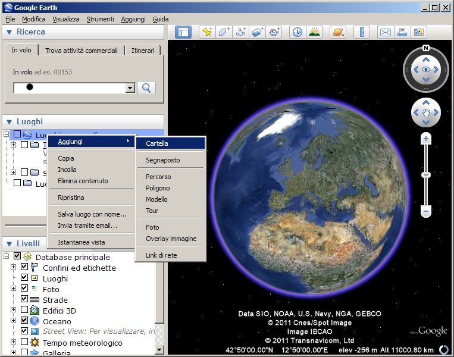
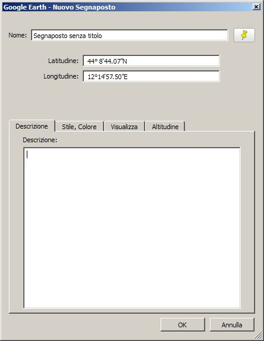
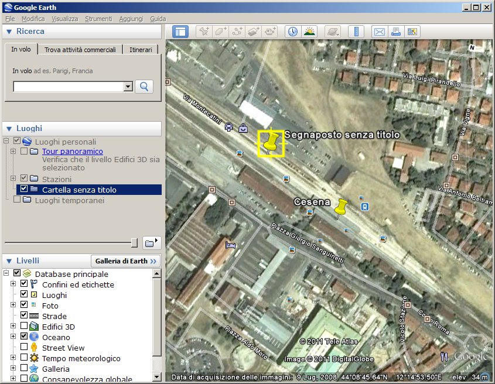
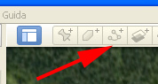
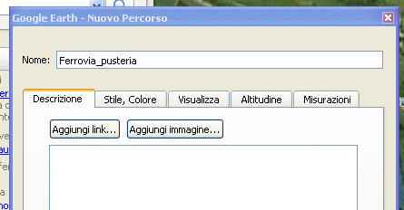
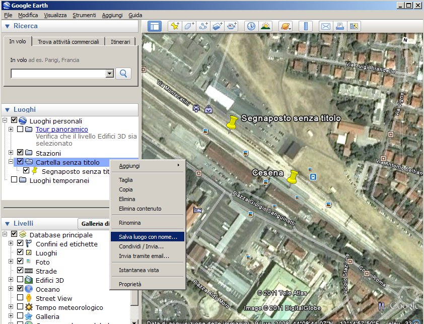
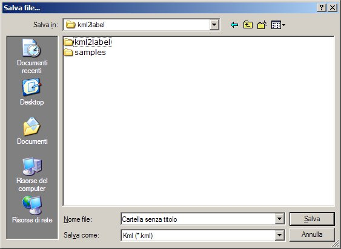
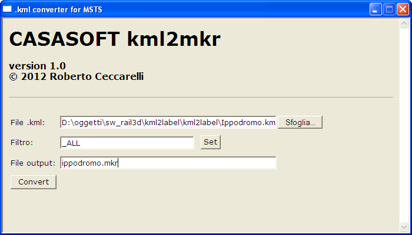

.. _marker:

***************
Creare i marker
***************

Per poter avere dei riferimenti durante la costruzione della route è oppurtuno creare un elenco di punti
di riferimento (detti marker) che realizzeremo con l'ausilio di 
:ref:`Google Earth<google_earth>` e di un :ref:`programma di conversione<kml2mkr>`.

.. _placemark:

Creare i placemark
==================

Aprimo Google Earth e per prima cosa creiamo una cartella in cui memorizzare tutti i placemark (e i path) che vogliamo racchiudere in un unico file.

Per fare questo posizioniamoci nel box “Luoghi” e clicchiamo con il tasto destro del mouse sulla prima voce dell'albero (dovrebbe essere “Luoghi personali”).
Selezioniamo “Aggiungi” e quindi “Cartella”; ci apparirà un box nel quale definire il nome della cartella, tutto il resto possiamo ignorarlo.
Selezioniamo la cartella appena creata e poi selezioniamo dalla toolbar il punteruolo giallo.

Ci apparirà il box riportato sopra dove potremo nominare il nostro placemark. 
Lasciando aperto questo box spostiamo il puntatore giallo circondato da un quadrato nel punto desiderato, quindi diamo “Ok” nel box.

Il placemark apparirà all'interno della cartella.

.. _path:

Definire un path
----------------

La creazione di un path non differisce molto dalla creazione dei singoli placemark 
(in effetti vengono salvati come un placemark con coordinate multiple).
Può essere molto comodo per seguire tracciato ferroviari, strade, fiumi...

Lo strumento da utilizzare è quello indicato nella figura sotto.

Del tutto simile a quello già visto il box delle proprietà

Attenzione: la finestra delle proprietà deve restare aperta durante tutta l'operazione di individuazione dei punti del percorso.

.. _savekml:

Salvare i dati
--------------

Posizionati tutti i placemark e creati i path possiamo procedere al salvataggio.

Clicchiamo con il tasto desto del mouse sulla cartella che vogliamo salvare e scegliamo “Salva luogo con nome”

Apparirà la consueta form di windows in cui specificare il nome e la posizione con cui salvare.
Fate attenzione al tipo di file: verrà proposto .kmz, 
ma per le operazioni successive noi avremo bisogno del .kml che andrà scelto nel campo in basso come si vede nella figura sotto.

.. _convertkml:

Creare il file .mkr
===================

Se vogliamo visualizzare i marker nell'editor di route di Microsoft Train Simulator dobbiamo convertire
il file ``.kml`` in ``.mkr``, operazione che effettueremmo con il programma ``kml2mkr``

L'applicazione grafica viene lanciata facendo doppio click sul file ``kml2mkr.hta`` 
che mostra la finestra riportata sopra; di seguito il significato dei vari parametri.

 - **File .kml** (obbligatorio): il nome del file da convertire (può essere selezionato con il pulsante ``Sfoglia``)

 - **Filtro**: il nome del path da convertire oppure ``_ALL`` (converte tutti i punti), 
   ``_SPARSE`` (solo i punti che non sono path), ``_PATH`` (solo i path) ; 
   può essere selezionato con il bottone ``SET`` che mostra questa finestra 
   dove possiamo cliccare sulla riga desiderata (si chiude da sola)

   .. image:: images/kml2mkrf.jpg

 - **File output** (obbligatorio): il nome del file che conterrà il risultato dell'elaborazione

Se abbiamo selezionato un path verranno creati tanti marker numerati per ogni singolo punto
che avremo scelto durante la sua definizione.

Premendo il tasto ``Convert`` si avvia l'elaborazione al termine della quale potremo copiare 
il file nella cartella principale della route; il file si deve obbligatoriamente 
chiamare come la route ed avere estensione ``.mkr``